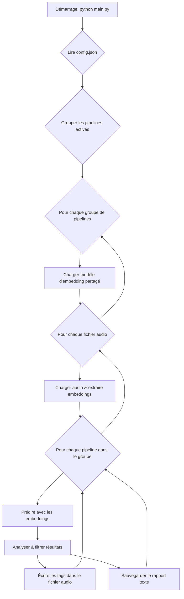

# Spécifications Techniques - AutoTag

## 1. Introduction

Ce document fournit une description technique détaillée de l'application AutoTag. Il a pour but de décrire l'architecture logicielle, les composants clés, le flux de données, les modèles utilisés et les dépendances principales. Il est destiné aux développeurs souhaitant contribuer au projet ou comprendre son fonctionnement interne.

## 2. Architecture du Système

AutoTag est une application en ligne de commande (CLI) conçue autour d'une architecture modulaire et pilotée par la configuration. Le système est orchestré par un script principal (`main.py`) qui exécute une série de "pipelines" de traitement définis dans un fichier `config.json`.

Le flux d'exécution principal est le suivant :

1.  **Chargement de la Configuration** : L'application lit `config.json` pour identifier tous les pipelines activés et leurs paramètres.
2.  **Orchestration et Optimisation** : Le script `main.py` groupe intelligemment les pipelines qui partagent le même dossier de données et le même modèle d'embedding. Cette étape est cruciale pour l'optimisation des performances, car elle permet de ne calculer les embeddings (l'opération la plus coûteuse) qu'une seule fois par fichier audio pour un groupe de pipelines.
3.  **Traitement par Groupe** : Pour chaque groupe de pipelines optimisé :
    a.  Le modèle d'embedding partagé et la liste des fichiers audio sont chargés en mémoire.
    b.  L'application itère sur chaque fichier audio. Pour un fichier donné, l'audio est chargé et les embeddings sont extraits.
    c.  **Exécution des Pipelines** : Pour chaque pipeline au sein du groupe, les embeddings partagés sont utilisés pour effectuer une prédiction spécifique (genre, humeur, etc.). Le résultat est ensuite analysé, filtré, puis écrit dans les métadonnées du fichier audio et dans un fichier de rapport texte.

*(Note : Ceci est une représentation textuelle d'un diagramme conceptuel)*

## 3. Description des Composants Clés

Le code source est principalement situé dans le répertoire `src/`.

### 3.1. Orchestration (`main.py`)

-   **Rôle** : Point d'entrée de l'application. Il n'effectue aucune logique de traitement audio ou de prédiction lui-même.
-   **Fonctionnalités** :
    -   Charge la configuration via `config_loader`.
    -   Nettoie les fichiers de résultats précédents des pipelines activés.
    -   Implémente la logique de groupement des pipelines en se basant sur la clé `(data_folder, embedding_model_path, sample_rate)`.
    -   Orchestre les boucles imbriquées pour le traitement par groupe, par fichier, et par pipeline.
    -   Gère les erreurs de haut niveau (configuration, erreurs de groupe).
    -   Utilise `tqdm` pour afficher une barre de progression pour le traitement des fichiers au sein d'un groupe.

### 3.2. Configuration (`src/config.py`, `src/config_loader.py`)

-   `config.py` : Définit les Pydantic-like data classes (`Config`, `PipelineConfig`) qui structurent la configuration en mémoire et assurent la validation des types.
-   `config_loader.py` : Contient la fonction `load_config_from_json` qui lit le fichier JSON, le valide, ignore les pipelines désactivés (`"enabled": false`), et instancie les objets `Config` et `PipelineConfig`.

### 3.3. Logique de Pipeline (`src/pipeline.py`)

-   **Classe `Pipeline`** : Représente un seul pipeline de traitement (ex: "genre").
-   **Responsabilités** :
    -   Ne charge plus l'audio ni les embeddings.
    -   **`load_prediction_resources()`** : Charge le modèle de classification (la "tête") et les métadonnées (la liste des classes) spécifiques à ce pipeline.
    -   **`process_file()`** : Reçoit en entrée un nom de fichier, son chemin et des **embeddings pré-calculés**. Il utilise ces embeddings pour effectuer la prédiction, appeler l'`Analyzer` pour filtrer les résultats, puis le `TagWriter` et le `ResultHandler` pour générer les sorties.

### 3.4. Traitement Audio (`src/audio/`)

-   `file_manager.py` (**`AudioFileManager`**) : Découvre les fichiers audio dans un dossier en se basant sur une liste d'extensions supportées. Ne scanne pas les sous-dossiers.
-   `loader.py` (**`AudioLoader`**) : Encapsule `essentia.standard.MonoLoader`. Sa seule responsabilité est de charger un fichier audio à partir d'un chemin, de le convertir en mono et de le ré-échantillonner à la fréquence spécifiée.

### 3.5. Modèles et Prédiction (`src/models/loader.py`, `src/prediction/`)

-   `models/loader.py` (**`ModelLoader`**) : Sert de façade pour le chargement des modèles TensorFlow via les wrappers Essentia.
    -   `load_embedding_model()` : Charge le modèle principal qui convertit l'audio en embeddings (ex: `TensorflowPredictEffnetDiscogs`).
    -   `load_prediction_model()` : Charge la tête de classification qui prend les embeddings en entrée (ex: `TensorflowPredict2D`).
    -   `load_classes()` : Extrait la liste des labels depuis les fichiers de métadonnées JSON des modèles.

-   `prediction/predictor.py` (**`Predictor`**) : Classe sans état qui encapsule les appels d'inférence.
    -   `extract_embeddings()` : Prend un modèle et des données audio, retourne des embeddings.
    -   `predict_genres()` : Prend un modèle et des embeddings, retourne des prédictions brutes (scores).

-   `prediction/analyzer.py` (**`PredictionAnalyzer`**) : Contient la logique métier pour interpréter les prédictions brutes.
    -   Calcule les scores moyens et la fréquence des labels sur tous les segments audio.
    -   Filtre les résultats en fonction des seuils (`threshold`, `min_freq`, `min_score`).
    -   Trie les résultats par pertinence et les limite (`max_labels`).

### 3.6. Sorties (`src/output/`)

-   `result_handler.py` (**`ResultHandler`**) : Formate et écrit les résultats d'analyse détaillés dans les fichiers `.txt`. Gère différents formats de sortie en fonction du type de pipeline.
-   `tag_writer.py` (**`TagWriter`**) : Gère l'écriture des métadonnées dans les fichiers audio en utilisant **Mutagen**.
    -   Détecte automatiquement le type de fichier (MP3, FLAC, MP4, WAVE).
    -   Appelle des méthodes internes spécifiques pour écrire les tags selon le format (ID3 TXXX, Vorbis Comments, MP4 Freeform Atoms).
    -   Contient la logique de nettoyage (`_clean_and_format_value_list`) pour formater la chaîne de caractères finale à écrire dans le tag.

## 4. Dépendances Techniques Clés

-   **Essentia** : Bibliothèque principale pour le traitement audio. Elle est utilisée pour :
    -   Le chargement et le ré-échantillonnage des fichiers audio (`MonoLoader`).
    -   L'exécution des inférences des modèles TensorFlow via ses wrappers optimisés (`TensorflowPredictEffnetDiscogs`, `TensorflowPredict2D`).
-   **TensorFlow** : Framework de machine learning utilisé pour entraîner les modèles. Il est une dépendance d'Essentia pour l'inférence et doit être installé, mais il n'est jamais appelé directement dans le code.
-   **Mutagen** : Bibliothèque de référence pour la manipulation des métadonnées audio. Elle est utilisée pour sa capacité à gérer une grande variété de formats de tags.
-   **NumPy** : Utilisé pour toutes les manipulations de données numériques (signaux audio, embeddings, prédictions).
-   **tqdm** : Utilisé pour fournir un retour visuel à l'utilisateur sous forme de barres de progression.

## 5. Modèles de Machine Learning

Le système utilise une approche en deux étapes :

1.  **Modèle d'Embedding** (`embedding_model_path`) :
    -   **Type** : Modèle de type *feature extractor*.
    -   **Rôle** : Transformer un segment de signal audio brut en un vecteur de caractéristiques de haute dimension (un *embedding*), qui représente sémantiquement le contenu audio.
    -   **Exemple** : `discogs-effnet`, qui est basé sur une architecture EfficientNet entraînée sur le jeu de données Discogs.

2.  **Modèle de Prédiction** (`prediction_model_path`) :
    -   **Type** : Modèle de type *classifier head* (ou *regression head*).
    -   **Rôle** : Prendre un vecteur d'embedding en entrée et produire une sortie, qui est généralement un vecteur de probabilités pour chaque classe possible (ex: 400 genres, 56 humeurs).
    -   **Technique** : Ces modèles sont beaucoup plus petits et plus rapides à exécuter que les modèles d'embedding. Ils sont entraînés spécifiquement pour une tâche (genre, humeur, etc.) en utilisant les embeddings comme entrée.

Cette architecture permet une grande flexibilité : un seul type d'embedding peut être utilisé pour alimenter de multiples têtes de prédiction, ce qui est la base de l'optimisation implémentée dans `main.py`.

